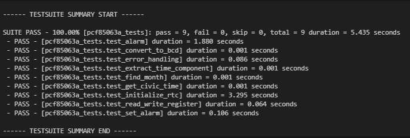

# PCF85063A RTC Driver Overview

## Introduction

This driver provides an interface for the PCF85063A Real-Time Clock (RTC) chip, 
designed for use with the Zephyr RTOS, and was built on the nRF52dk with testing 
through Unity/Ztest. It enables precise timekeeping and alarm functionality in 
embedded systems.

## Key Features

- RTC initialization and configuration
- Time setting and reading
- Alarm configuration and handling
- Register-level read and write operations
- Unit testing through Unity/Ztest
- Documentation handled by Doxygen: /docs/html/index.html

## Architecture

The driver is structured around core RTC operations, 
utilizing Zephyr's I2C and GPIO subsystems with asynchronous interrupt handling. 
It employs a modular design with separate functions for each major operation, 
enhancing maintainability and allowing for easy expansion of functionality. 

## Integration

To integrate this driver into your Zephyr project:
1. Include the driver files (`PCF85063A.c` and `PCF85063A.h`) in your project.
2. Configure your project's devicetree to include the PCF85063A device.
3. Enable necessary Zephyr configurations (I2C, GPIO) in your project's `.conf` file.

## Build Instructions

### Prerequisites

- nRF Connect SDK 2.5.0
- GNU Arm Embedded Toolchain
- CMake
- Doxygen

### Re-generating Documentation
- API documentation is provided through /doc/html/index.html, but can be regenerated locally
   - In root directory run doxygen Doxyfile

### Building the Project

The most straightforward way to build the project would be to open the VScode workspace with the 
nRF Connect extension enabled after cloning. Select the nRF Connect SDK v2.5.0 toolchain and west workspace v2.5.0.
Then simply build using the nRF Connect build tool selecting the prj.conf, board overlay file, and extra CMAKE arguments:

   - build: -DBOARD_ROOT="./zephyr/samples/sensor/pcf85063a" -DCACHED_CONF_FILE="./zephyr/samples/sensor/pcf85063a/prj.conf
   - build_unity: -DBOARD_ROOT="./zephyr/samples/sensor/pcf85063a" -DUNIT_TEST="1" -DCONFIG_ZTEST="y" -DCACHED_CONF_FILE="./zephyr/samples/sensor/pcf85063a/prj.conf"

However, below are instructions to build the project without nRF Connect and VSCode.

1. **Clone the Repository**

   ```bash
   git clone https://github.com/yourusername/yourproject.git
   cd yourproject
   ```

2. **Set Up the Environment**

   Source the environment script provided by the nRF Connect SDK:

   ```bash
   source /path/to/nrfconnect-sdk/zephyr/zephyr-env.sh
   ```

3. **Configure the Normal Build**

   Configure the normal build using CMake with the specified arguments:

   ```bash
   cmake -B build -GNinja \
     -DBOARD_ROOT="./zephyr/samples/sensor/pcf85063a" \
     -DCACHED_CONF_FILE="./zephyr/samples/sensor/pcf85063a/prj.conf"
   ```

4. **Build the Normal Project**

   Build the normal project using CMake:

   ```bash
   cmake --build build
   ```

5. **Configure the Unity Build for Unit Testing**

   Configure the unity build for unit testing using CMake with the specified arguments:

   ```bash
   cmake -B build_unity -GNinja \
     -DBOARD_ROOT="./zephyr/samples/sensor/pcf85063a" \
     -DUNIT_TEST="1" \
     -DCONFIG_ZTEST="y" \
     -DCACHED_CONF_FILE="./zephyr/samples/sensor/pcf85063a/prj.conf"
   ```

6. **Build the Unity Project for Unit Testing**

   Build the unity project for unit testing using CMake:

   ```bash
   cmake --build build_unity
   ```

7. **Flash the Project**

   Flash the compiled binaries to the device:

   ```bash
   nrfjprog --program build/zephyr/zephyr.hex --chiperase
   nrfjprog --reset
   ```

## Usage

Basic usage examples:

```c
// Initializing the RTC
uint8_t * time_array = get_civic_time();
rtc_error_t ret = initialize_RTC(time_array);

// Setting an alarm
uint8_t alarm_buffer[RTC_ALARM_REGISTER_SIZE] = {0x10, 0x10, 0x10, 0x12, 0};
ret = set_alarm(alarm_buffer, RTC_ALARM_REGISTER_SIZE);
```

For detailed API usage, refer to the Doxygen-generated documentation: /docs/html/index.html

# Testing
- Flash the build_unity compiled binary to the board
- Test suite will run automatically and print test results over serial output



# Dependencies

- Zephyr RTOS (tested with version 1.0)
- Zephyr I2C Driver
- Zephyr GPIO Driver

## Known Limitations

- Currently supports only 24-hour time format
- Alarm functionality limited to date/time matching (no periodic alarms)

## Future Improvements

- Add support for periodic alarms
- Implement power management features of the PCF85063A
- Implement timer features
- Extend test suite to cover a wider range of cases for read/write operations
- Add Python-based interface for ease of programming and setting alarms

## Additional Resources

- [PCF85063A Datasheet](https://www.nxp.com/docs/en/data-sheet/PCF85063A.pdf)
- [Zephyr RTOS Documentation](https://docs.zephyrproject.org/)
